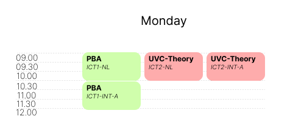

# Viewer
The viewer is currently written in Svelte; however it is better to change it to Sveltekit

## Status
- [x] basic filtering
- [ ] Advanced filtering
- [ ] Show different quartiles/semesters/terms
- [ ] implement error reporting from the error reporting microservice

### Filtering
For now the basic filtering is set up.
- Improve current filter from an OR filter to an AND filter
- Add terms filtering

### Show different terms
When you want to show different terms in one view, you have to carefully design the view and leave out details.

